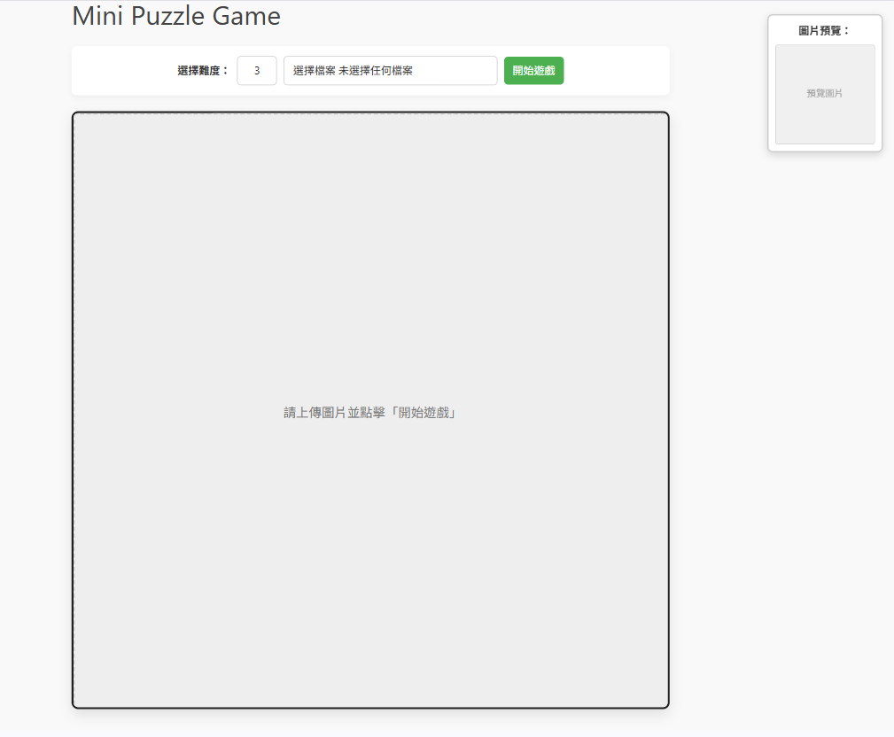

# Mini Puzzle Game

一個純 HTML、CSS、JavaScript 製作的拼圖小遊戲，支援使用者上傳圖片、自訂難度（2x2 ～ 10x10），並使用拖曳操作完成拼圖。

[點我預覽頁面](https://raellen.github.io/mini-puzzle-game/)



---

## 功能 Features

- 自訂拼圖難度（輸入 2 ～ 10）
- 上傳任意圖片作為拼圖
- 預覽圖片浮動顯示於右上角
- 拼圖打亂，自動生成格子背景位置
- 拖曳交換格子進行拼圖
- 判斷是否完成拼圖，成功提示

---

## 使用方式 Usage

1. 開啟 `index.html` 檔案於瀏覽器中
2. 點擊「選擇圖片」上傳你想玩的圖片
3. 輸入拼圖難度（例如 `3` 表示 3x3）
4. 點擊「開始遊戲」
5. 使用滑鼠拖曳拼圖格子交換位置，直到完成！

---

## 專案結構

```bash
.
├── index.html               # 主遊戲畫面
├── style.css                # 所有樣式設定
├── script.js                # 遊戲邏輯
└── images/
    └── mini-puzzle-game.png  # README 用預覽圖片
```
